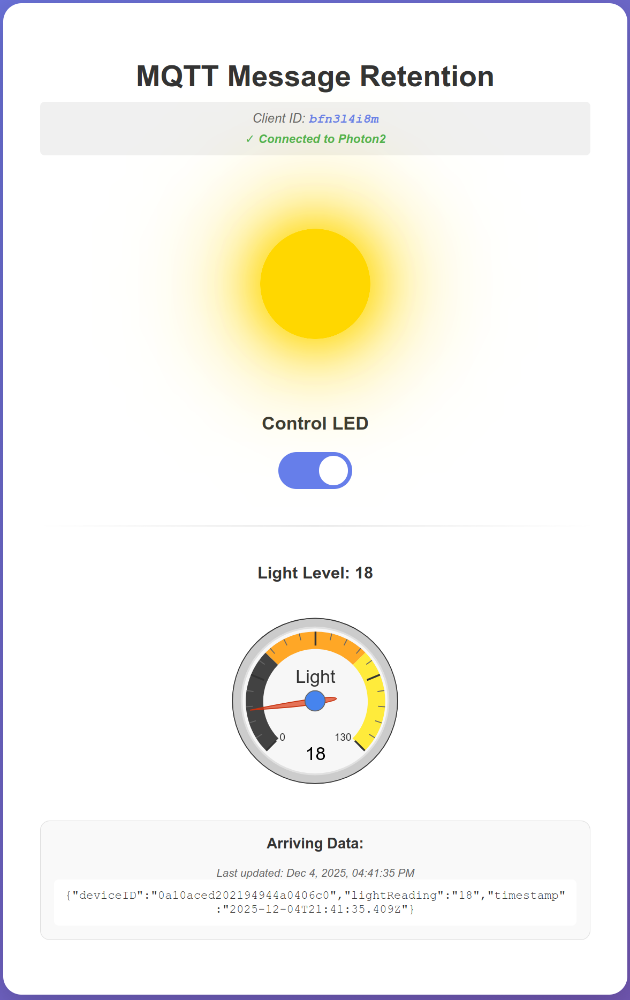
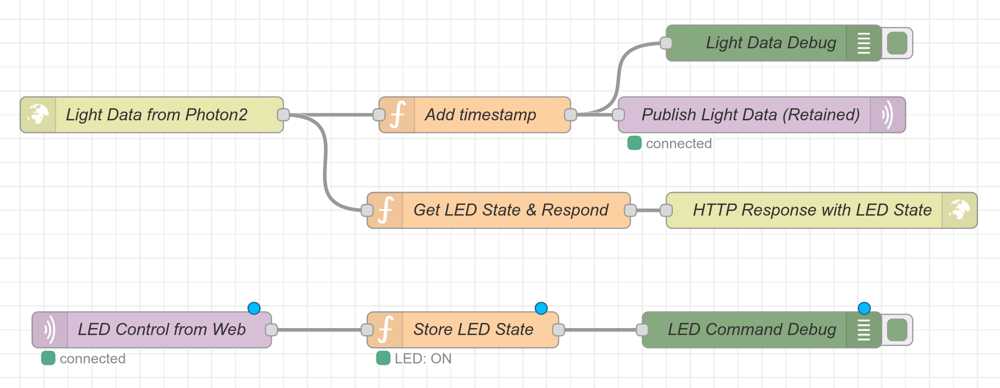

# IoT Smart Bulb Controller with MQTT Message Retention

A real-time IoT system that leverages **MQTT message retention** and **QoS Level 1** for reliable state management between a Particle Photon2 microcontroller and multiple web clients.

## 📸 Screenshots

### Web User Interface


*Real-time light monitoring dashboard with animated bulb visualization and LED control switch*

### Node-RED Flow


*Node-RED flow showing HTTP input, timestamp addition, MQTT publish with retention, and LED state management*

## 📋 Project Overview

This project demonstrates the power of **MQTT broker message retention** for maintaining state persistence in IoT applications. The system monitors ambient light levels using a photoresistor and allows remote LED control through a web interface, with all state synchronized across multiple clients using retained MQTT messages.

### Key Features

- ✅ **MQTT Message Retention** - Last known state persists across disconnections
- ✅ **QoS Level 1** - Guaranteed message delivery with acknowledgment
- ✅ **Multi-Client Synchronization** - All browsers stay in sync automatically
- ✅ **Smart Connection Monitoring** - Real-time device status with stale data detection
- ✅ **Real-time Updates** - Instant LED control and light level visualization
- ✅ **Animated UI** - Visual bulb animation and gauge chart

## 🏗️ System Architecture

```
Photon2 → HTTP POST → Node-RED → MQTT Broker (Retained) → WebSocket → Web Clients
                                       ↓
                                  Photon2 (LED Control via MQTT)
```

### Communication Flow

1. **Light Data Path:**
   - Photon2 reads photoresistor every 5 seconds
   - Sends HTTP POST to Node-RED
   - Node-RED adds timestamp and publishes to MQTT with retain flag
   - Web clients receive data via WebSocket

2. **LED Control Path:**
   - User toggles switch in web UI
   - Browser publishes MQTT message with retain flag
   - Photon2 receives command instantly via MQTT subscription
   - All other web clients synchronize automatically

## 🔧 Technologies Used

- **Hardware:** Particle Photon2 Microcontroller
- **IoT Protocol:** MQTT (Mosquitto Broker)
- **Middleware:** Node-RED
- **Backend:** Node.js + Express
- **Frontend:** HTML/CSS/JavaScript, Google Charts, Paho MQTT
- **Communication:** HTTP, MQTT, WebSocket

## 📦 Prerequisites

- Particle Photon2 microcontroller
- Mosquitto MQTT broker
- Node-RED
- Node.js (v14 or higher)
- Photoresistor connected to A0 pin
- LED connected to D7 pin (or use onboard LED)

## 🚀 Installation & Setup

### 1. Install Dependencies

```bash
# Install Mosquitto MQTT Broker
sudo apt-get update
sudo apt-get install mosquitto mosquitto-clients

# Install Node-RED
npm install -g --unsafe-perm node-red

# Install Node.js dependencies
cd Final_Project
npm install
```

### 2. Configure Mosquitto

Enable WebSocket support by editing `/etc/mosquitto/mosquitto.conf`:

```conf
listener 1883
protocol mqtt

listener 9002
protocol websockets

allow_anonymous true
```

Restart Mosquitto:

```bash
sudo systemctl restart mosquitto
```

### 3. Import Node-RED Flow

1. Start Node-RED: `node-red`
2. Open `http://localhost:1880`
3. Import `node-red-flow-updated.json`
4. Deploy the flow

### 4. Flash Photon2 Firmware

1. Open `light_sensor.ino` in Particle Workbench
2. Update the server IP address to your machine's IP
3. Flash to Photon2

### 5. Start Web Server

```bash
node index.js
```

Access the interface at `http://localhost:3004/index.html` or `http://YOUR_IP:3004/index.html`

## 📊 MQTT Topics

| Topic | Publisher | Subscribers | Retained | QoS | Purpose |
|-------|-----------|-------------|----------|-----|---------|
| `Photon2LightLevel` | Node-RED | Web Clients | Yes | 1 | Light sensor data |
| `Photon2LEDControl` | Web Clients | Photon2, Node-RED | Yes | 1 | LED state commands |

## 🎯 MQTT Message Retention Benefits

### Why Retention Matters

1. **State Persistence** - LED state survives broker restarts
2. **Instant Synchronization** - New clients immediately see current state
3. **No Polling Required** - Clients get last known value without asking
4. **Multi-User Consistency** - All users see the same state
5. **Offline Awareness** - Distinguish between fresh and stale data

### QoS Level 1 Advantages

- Guaranteed delivery with acknowledgment
- Prevents lost LED commands or sensor readings
- Balances reliability with performance
- Handles network interruptions gracefully

## 🎮 Usage

1. **Monitor Light Levels:**
   - View real-time light readings on gauge chart
   - See current light level value
   - Watch data arrive in real-time

2. **Control LED:**
   - Toggle switch to turn LED ON/OFF
   - Bulb animation shows current state
   - Changes sync across all connected browsers

3. **Connection Status:**
   - **Connected (Green):** Receiving fresh data
   - **Connecting (Yellow):** Initial broker connection
   - **Stale (Orange):** Showing retained data, device offline
   - **Disconnected (Red):** Connection failure

## 🔍 Monitoring Commands

```bash
# Watch all MQTT traffic
mosquitto_sub -h localhost -t '#' -v

# Monitor light level topic
mosquitto_sub -h localhost -t 'Photon2LightLevel' -v

# Monitor LED control topic
mosquitto_sub -h localhost -t 'Photon2LEDControl' -v

# Check retained message count
mosquitto_sub -h localhost -t '$SYS/broker/retained messages/count' -C 1

# Watch broker logs
sudo journalctl -u mosquitto -f
```

## 📁 Project Structure

```
Final_Project/
├── index.js                           # Express web server (port 3004)
├── package.json                       # Node.js dependencies
├── package-lock.json                  # Locked dependency versions
├── .gitignore                         # Git ignore rules
├── README.md                          # This file - project documentation
├── public/
│   └── index.html                    # Web UI with MQTT client and LED control
├── images/
│   ├── web-ui-screenshot.png         # Screenshot of web interface
│   ├── node-red-flow-screenshot.png  # Screenshot of Node-RED flow
│   └── README.md                     # Images directory documentation
├── light_sensor.ino                   # Photon2 firmware (Arduino/C++)
├── node-red-flow-updated.json        # Node-RED flow with MQTT retention
├── presentation.html                  # Interactive HTML presentation slides
└── IoT Project Presentation.pdf      # PDF version of presentation
```

## 🎓 Key Concepts Demonstrated

### 1. Message Retention

- Broker stores last message on each topic
- New subscribers receive it immediately
- Cleared by publishing empty payload with retain flag

### 2. Quality of Service

- **QoS 0:** Fire and forget
- **QoS 1:** At least once delivery (used in this project)
- **QoS 2:** Exactly once delivery

### 3. Connection Monitoring

- **Timeout:** 8 seconds (allows one missed reading)
- **Check Interval:** 500ms for instant detection
- **Photon2 Interval:** 5 seconds between readings

### 4. Multi-Client Synchronization

- Client ID filtering prevents self-triggering
- Retained messages ensure consistency
- WebSocket enables real-time updates

## 🛠️ Configuration

### Connection Parameters

| Service | Port | Protocol |
|---------|------|----------|
| Web Server | 3004 | HTTP |
| Node-RED | 1880 | HTTP |
| MQTT Broker | 1883 | MQTT |
| MQTT WebSocket | 9002 | WebSocket |

### Timing Constants

```javascript
const CONNECTION_TIMEOUT = 8000;  // 8 seconds
const CHECK_INTERVAL = 500;        // 0.5 seconds
const PHOTON_INTERVAL = 5000;      // 5 seconds (in firmware)
```

## 🐛 Troubleshooting

**LED toggles on its own:**

- Ensure Node-RED flow doesn't have republish loop
- Check that only web clients publish to LED control topic

**Connection shows "Stale" immediately:**

- Check Photon2 is powered and connected
- Verify MQTT broker is running
- Confirm firewall allows port 1883

**Web clients not syncing:**

- Verify all clients subscribe to `Photon2LEDControl`
- Check retain flag is set on LED control messages
- Ensure client ID filtering is working

**Debug output not showing in Node-RED:**

- Refresh Node-RED browser page
- Check debug panel is open (bug icon)
- Verify debug nodes are deployed

## 📷 How to Add Screenshots

To complete the documentation, add your own screenshots:

1. **Web UI Screenshot:**
   - Open the application at `http://YOUR_IP:3004/index.html`
   - Take a screenshot showing the bulb, LED switch, gauge, and connection status
   - Save as `images/web-ui-screenshot.png`

2. **Node-RED Flow Screenshot:**
   - Open Node-RED at `http://YOUR_IP:1880`
   - Navigate to your flow tab
   - Take a screenshot showing the complete flow with all nodes
   - Save as `images/node-red-flow-screenshot.png`

3. **Commit the screenshots:**

   ```bash
   git add images/
   git commit -m "Add project screenshots"
   git push
   ```

## 🤝 Contributing

Feel free to fork this project and submit pull requests for improvements!

## 📄 License

This project is for educational purposes.

## 👥 Team

**Team A** - IoT Final Project - December 2025

## 🔗 Resources

- [MQTT Protocol](https://mqtt.org/)
- [Particle Photon2 Documentation](https://docs.particle.io/photon/)
- [Node-RED Documentation](https://nodered.org/docs/)
- [Mosquitto MQTT Broker](https://mosquitto.org/)
- [Paho MQTT JavaScript Client](https://eclipse.org/paho/clients/js/)

---

**Project Highlights:** This system demonstrates production-ready IoT architecture using MQTT message retention for reliable state management, making it ideal for smart home applications, industrial monitoring, and multi-user control systems.
